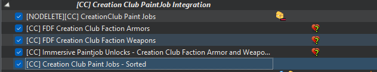

# Creation Club Paint Jobs

This modlist has integrated distribution for some of the Creation Club Armor and Weapon Paint Skins

Faction members will wear appropriate paint, thanks to Faction Distribution Framework

Here is a list of the supported paints and the files names

| Skin Name               |  Weapon Paint                        |  Armor Paint                         |
|-------------------------|--------------------------------------|--------------------------------------|
|  Aquatic Camo           | ccbgsfo4105-ws_camoblue.esl          | ccbgsfo4092-as_camoblue.esl          |
|  Swamp Camo             | ccbgsfo4106-ws_camogreen.esl         | ccbgsfo4093-as_camogreen.esl         |
|  Desert Camo            | ccbgsfo4107-ws_camotan.esl           | ccbgsfo4094-as_camotan.esl           |
|  Children of Atom       | ccbgsfo4108-ws_childrenofatom.esl    | ccbgsfo4095-as_childrenofatom.esl    |
|  Pickman                | ccbgsfo4112-ws_pickman.esl           | ccbgsfo4098-as_pickman.esl           |
|  Tunnel Snakes          | ccbgsfo4118-ws_tunnelsnakes.esl      | ccbgsfo4103-ws_tunnelsnakes.esl      |
|  Atom Cats              | ccgcafo4002-factionws02acats.esl     | ccgcafo4012-factionas01acat.esl      |
|  Brotherhood of Steel   | ccgcafo4003-factionws03bos.esl       | ccgcafo4013-factionas02bos.esl       |
|  Gunners                | ccgcafo4004-factionws04gun.esl       | ccgcafo4014-factionas03gun.esl       |
|  Institute              | ccgcafo4008-factionws08inst.esl      | ccgcafo4017-factionas06inst.esl      |
|  Minutemen              | ccgcafo4009-factionws09mm.esl        | ccgcafo4018-factionas07mm.esl        |
|  Railroad               | ccgcafo4010-factionws10rr.esl        | ccgcafo4020-factionas09rr.esl        |
|  Hot Rod Flames         | ccgcafo4007-factionws07hrflames.esl  | ccgcafo4021-factionas10hrflames.esl  |
|  Hot Rod Pink           | ccgcafo4005-factionws05hrpink.esl    | ccgcafo4015-factionas04hrpink.esl    |
|  Hot Rod Shark          | ccgcafo4006-factionws06hrshark.esl   | ccgcafo4016-factionas05hrshark.esl   |
|  Vault Tec              | ccgcafo4011-factionws11vt.esl        | ccgcafo4022-factionas11vt.esl        |
|  Army                   | ccgcafo4001-factionws01army.esl      | ccgcafo4023-factionas12army.esl      |

## Repacking Creation Club Content

This mod list is very close to the BA2 limit, so it is necessary to repack the BA2 files.  Exceeding the BA2 limit will cause the game to crash on load.

To repack the creation club files do the following

1. Download all the listed creation club paint jobs from the in-game menu.
2. Move the .esl and .ba2 files for the paint jobs listed above to `<install folder>\mods\[NODELETE][CC] CreationClub Paint Jobs` folder.
3. Delete any other creation club files.
4. Start Mod Organizer
5. Enable the `[NODELETE][CC] CreationClub Paint Jobs` mod and the related mods in the [CC] Creation Club PaintJob Integration section. 

   

6. In the right pane select the Archives tab.
7. Scroll down to `[NODELETE] Creation Club Paint Jobs`
8. Right click and select Extract.  Wait for completion.
9. Select `<install folder>\mods\[NODELETE][CC] CreationClub Paint Jobs`
10. Open the Windows File Explorer. Navigate to `<install folder>\mods\[NODELETE][CC] CreationClub Paint Jobs`
11. Delete all the BA2s files.
12. In Mod Organizer, select the puzzle icon -> BSA packer. Select `[NODELETE][CC] CreationClub Paint Jobs` as the mod to pack. Select `ccbgsfo4092-as_camoblue` as the name for the packed archive.

    

14. Click OK. Click OK again.  Wait for completion.
15. You should now have just two large BA2 archives.
16. You can delete the three folders that were created during the extraction step.

Having created the archives in a mod folder with the [NODELETE] prefix, you will not have to repeat this process when updating the modlist.

